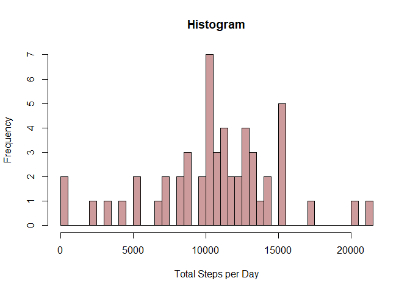
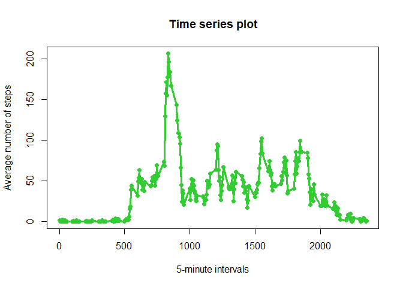
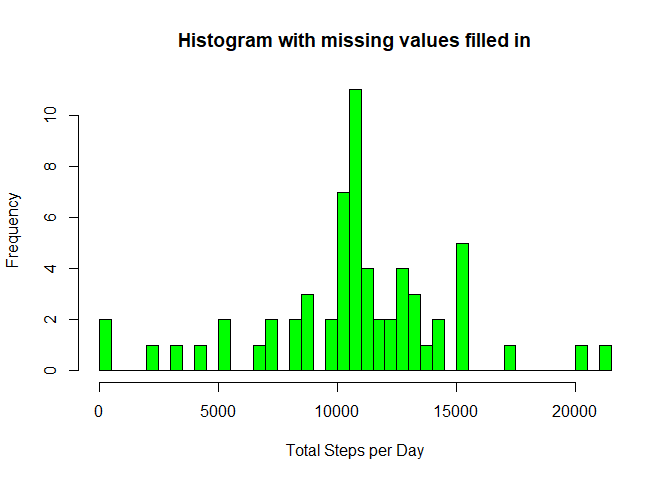
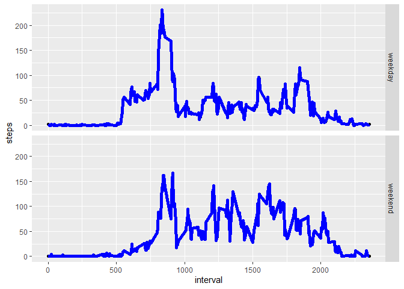

Reproducible Research Week 2 Course Project 
=============================================
## By YT  
### 1. Load and preprocess the data

The following code reads the data from the current working directory.
All code chucks are set to visible. 

```r
knitr::opts_chunk$set(echo = TRUE)
data<-read.csv("activity.csv",header=TRUE,as.is=TRUE,na.strings="NA")
data$date<-as.Date(data$date,"%Y-%m-%d")
```

### 2. What is mean total number of steps taken per day?

For this question, the missing values are ignored in the dataset.

2.1 Calculate the total number of steps taken per day

```r
library(dplyr)
```

```
## 
## Attaching package: 'dplyr'
```

```
## The following objects are masked from 'package:stats':
## 
##     filter, lag
```

```
## The following objects are masked from 'package:base':
## 
##     intersect, setdiff, setequal, union
```

```r
## Group data by date
by_date<-group_by(data,date)
## Total steps per day
totalsteps<-as.data.frame(summarize(by_date,sum(steps)))
## Rename columns
colnames(totalsteps)<-c("date","steps")
totalsteps
```

```
##          date steps
## 1  2012-10-01    NA
## 2  2012-10-02   126
## 3  2012-10-03 11352
## 4  2012-10-04 12116
## 5  2012-10-05 13294
## 6  2012-10-06 15420
## 7  2012-10-07 11015
## 8  2012-10-08    NA
## 9  2012-10-09 12811
## 10 2012-10-10  9900
## 11 2012-10-11 10304
## 12 2012-10-12 17382
## 13 2012-10-13 12426
## 14 2012-10-14 15098
## 15 2012-10-15 10139
## 16 2012-10-16 15084
## 17 2012-10-17 13452
## 18 2012-10-18 10056
## 19 2012-10-19 11829
## 20 2012-10-20 10395
## 21 2012-10-21  8821
## 22 2012-10-22 13460
## 23 2012-10-23  8918
## 24 2012-10-24  8355
## 25 2012-10-25  2492
## 26 2012-10-26  6778
## 27 2012-10-27 10119
## 28 2012-10-28 11458
## 29 2012-10-29  5018
## 30 2012-10-30  9819
## 31 2012-10-31 15414
## 32 2012-11-01    NA
## 33 2012-11-02 10600
## 34 2012-11-03 10571
## 35 2012-11-04    NA
## 36 2012-11-05 10439
## 37 2012-11-06  8334
## 38 2012-11-07 12883
## 39 2012-11-08  3219
## 40 2012-11-09    NA
## 41 2012-11-10    NA
## 42 2012-11-11 12608
## 43 2012-11-12 10765
## 44 2012-11-13  7336
## 45 2012-11-14    NA
## 46 2012-11-15    41
## 47 2012-11-16  5441
## 48 2012-11-17 14339
## 49 2012-11-18 15110
## 50 2012-11-19  8841
## 51 2012-11-20  4472
## 52 2012-11-21 12787
## 53 2012-11-22 20427
## 54 2012-11-23 21194
## 55 2012-11-24 14478
## 56 2012-11-25 11834
## 57 2012-11-26 11162
## 58 2012-11-27 13646
## 59 2012-11-28 10183
## 60 2012-11-29  7047
## 61 2012-11-30    NA
```

2.2 Make a histogram of the total number of steps taken each day

```r
## Histogram of the total number of steps taken each day
hist(totalsteps$steps,col="rosybrown3",xlab="Total Steps per Day",main="Histogram",breaks=35)
```

<!-- -->

2.3 Calculate and report the mean and median of the total number of steps taken per day


```r
meansteps<-mean(totalsteps$steps,na.rm=TRUE)
meansteps
```

```
## [1] 10766.19
```

```r
mediansteps<-median(totalsteps$steps,na.rm=TRUE)
mediansteps
```

```
## [1] 10765
```

### 3. What is the average daily activity pattern?

3.1 Make a time series plot of the 5-minute interval and the average number of steps taken, averaged across all days 


```r
## Group data by interval
by_interval<-group_by(data,interval)
## Calculate mean number of steps for each interval
meansteps2<-as.data.frame(summarize(by_interval,mean(steps,na.rm=TRUE)))
colnames(meansteps2)<-c("interval","steps")
plot(meansteps2$interval,meansteps2$steps,main="Time series plot",
     xlab="5-minute intervals",
     ylab="Average number of steps",col="limegreen",
     pch=19)
lines(meansteps2,col="limegreen", lwd=3)
```

<!-- -->

3.2 Which 5-minute interval, on average across all the days in the dataset, contains the maximum number of steps?


```r
maxsteps<-meansteps2[which(meansteps2$steps==max(meansteps2$steps)),]
maxsteps
```

```
##     interval    steps
## 104      835 206.1698
```

### 4. Imputing missing values
4.1 Calculate and report the total number of missing values in the dataset (i.e. the total number of rows with NAs)

```r
sum(is.na(data$steps))
```

```
## [1] 2304
```
4.2 Devise a strategy for filling in all of the missing values in the dataset. 

The following strategy for filling in all the missing values was used.
Identify the missing values in the data. 
Replace them with the number of steps averaged across all days for each 5-minute interval was used.

```r
## Mean for the interval
meanint<-meansteps2
## Identify missing values in the data
missing<-data[is.na(data$steps),]
## Replace missing values with means for corresponsing 5-minute interval
missing$steps <- replace(missing$steps, missing$interval %in% meanint$interval, meanint$steps) 
```
4.3 Create a new dataset that is equal to the original dataset but with the missing data filled in.

```r
data2<-data
## Replace missing values in column "steps" of the data set with the averages for the 5-minute intervals
data2[is.na(data2$steps),"steps"]<-missing$steps
```
4.4 Make a histogram of the total number of steps taken each day and calculate and report the mean and median total number of steps taken per day. Do these values differ from the estimates from the first part of the assignment? What is the impact of imputing missing data on the estimates of the total daily number of steps?


```r
## Group data by date
by_date2<-group_by(data2,date)
## Total steps per day
totalsteps2<-as.data.frame(summarize(by_date2,sum(steps)))
colnames(totalsteps2)<-c("date","steps")
## Histogram of the total number of steps taken each day
hist(totalsteps2$steps,col="green",xlab="Total Steps per Day",main="Histogram with missing values filled in",breaks=35)
```

<!-- -->

```r
## Mean of the total steps taken per day
mean_steps<-mean(totalsteps2$steps,na.rm=TRUE)
mean_steps
```

```
## [1] 10766.19
```

```r
## Median of the total steps taken per day
median_steps<-median(totalsteps2$steps,na.rm=TRUE)
median_steps
```

```
## [1] 10766.19
```
The mean and median haven't changed much. The histograms changed slightly.

### 5. Are there differences in activity patterns between weekdays and weekends?
The dataset with the filled-in missing values was used for this part.

5.1 Create a new factor variable in the dataset with two levels – “weekday” and “weekend” indicating whether a given date is a weekday or weekend day.


```r
## Identify the day the dates
day<-weekdays(data2$date)
## Add an additional column with the day
data3<-mutate(data2,day)
weekday<-c("Monday","Tuesday","Wednesday","Thursday","Friday")
weekend<-c("Saturday","Sunday")
## Replace day with either weekday or weekend
data3$day<-replace(data3$day,data3$day %in% weekday,"weekday")
data3$day<-replace(data3$day,data3$day %in% weekend,"weekend")
```

5.2 Make a panel plot containing a time series plot of the 5-minute interval (x-axis) and the average number of steps taken, averaged across all weekday days or weekend days (y-axis). 


```r
## Group data by day then by interval
by_dayint<-group_by(data3,day,interval)
## Calculate mean steps
meanst<-as.data.frame(summarize(by_dayint,mean(steps,na.rm=TRUE)))
colnames(meanst)<-c("day","interval","steps") 
library(ggplot2)
g<-ggplot(meanst,aes(interval,steps,group=day))+geom_point()+facet_grid(day~.)+
    geom_line(data=meanst,aes(interval,steps,group=day),lwd=2,col="blue")
g
```

<!-- -->


